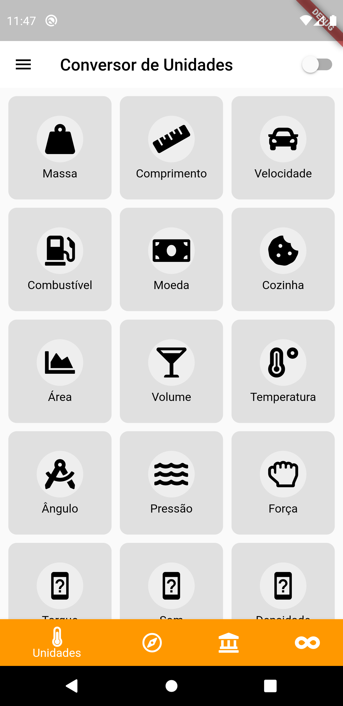
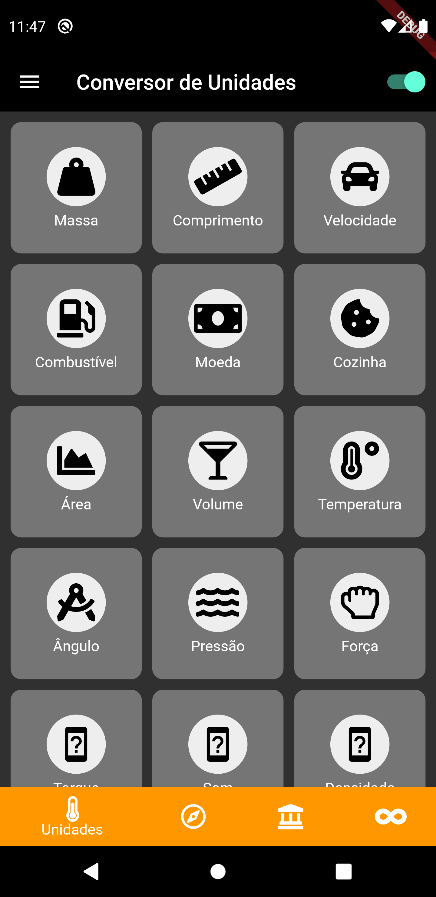
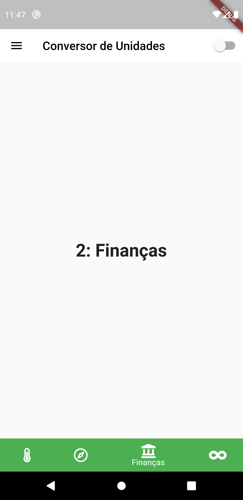
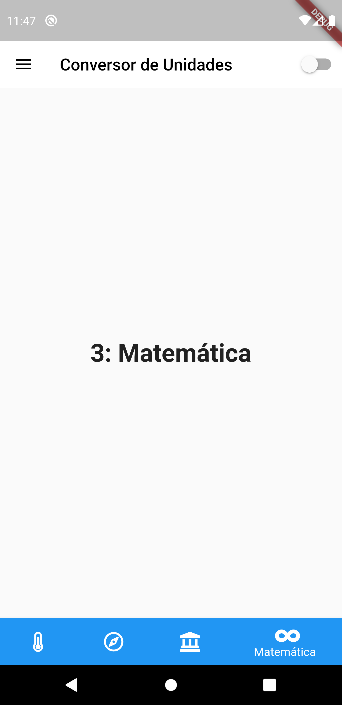
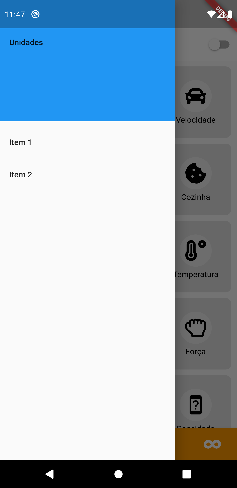
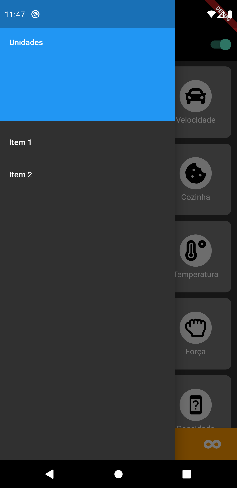

# unit_converter

An open-source unit converter using Flutter.

## Getting Started

A few resources that inspired me somehow on this project:

- [Unit Converter](https://play.google.com/store/apps/details?id=com.androidapps.unitconverter)
- [DeividWillyan/Flutter-BankNuter](https://github.com/DeividWillyan/Flutter-BankNuter)
- [DhipuMathew/Unit Converter - Interaction](https://dribbble.com/shots/4481737-Unit-Converter-Interaction)
- [Flutter/BottomNavigationBar class](https://api.flutter.dev/flutter/material/BottomNavigationBar-class.html)
- [Hans Muller/Getting to the Bottom of Navigation in Flutter](https://medium.com/flutter/getting-to-the-bottom-of-navigation-in-flutter-b3e440b9386)
- [Vipin Vijayan/App Theming in Flutter — Dark Mode/ Light Mode](https://itnext.io/app-theming-in-flutter-dark-mode-light-mode-27d9adf3cee)

# Screenshot

The following images are up-to-date versions of the app. I'll update them as the project improves.

## Unidades

|                        Página de Unidades                        |                          Página de Unidades no Modo Escuro                           |
| ---------------------------------------------------------------- | ------------------------------------------------------------------------------------ |
|||

## Ferramentas

|                   Página de Ferramentas                   |                      Página de Ferramentas no Modo Escuro                      |
| --------------------------------------------------------- | ------------------------------------------------------------------------------ |
||

## Finanças

|                    Página de Finanças                    |                       Página de Finanças no Modo Escuro                       |
| -------------------------------------------------------- | ----------------------------------------------------------------------------- |
||

## Matemática

|                  Página de Matemática                   |                     Página de Matemática no Modo Escuro                      |
| ------------------------------------------------------- | ---------------------------------------------------------------------------- |
||

## Gaveta

|                   Gaveta                    |                      Gaveta no Modo Escuro                       |
| ------------------------------------------- | ---------------------------------------------------------------- |
||
